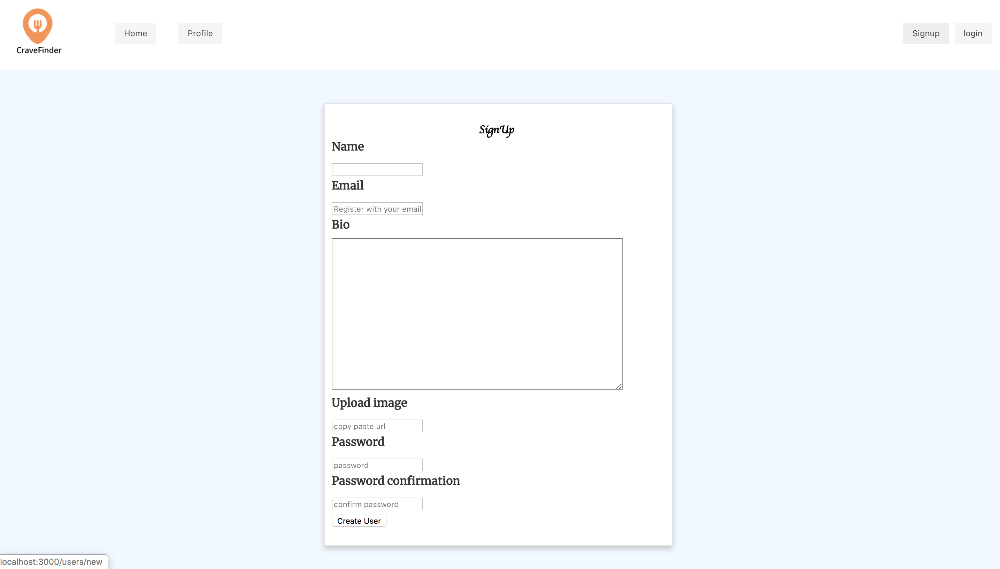

<h1 align="center">CraveFinder :pizza: :hamburger:</h1>

<h4 align="center">CraveFinder is a Yelp inspired web application created by Saima Rahman. This App is built using Ruby on Rails for both frontend and backend</h4>

  

  
 ## Features 
Users can:
- Sign-up/Log-in/Log-out
- Create, Update, and Delete a profile.
- Create, Update, and Delete a Review for a Restaurant.
- Create, a Restaurant
- Visit another, User's profile
- Sort/Filter restaurant by Category and Location
- Authentication
  - Session is authenticated in the backend. All data corresponds to the proper user.
- Validation
  - Validates data before saving to database
  
## Tech Stack
This web app makes use of the following:
- Ruby [2.6.1]
- Rails [~> 6.0.2] - MVC Web Framework
- SQLite3 [~> 1.4] - Database
- Bulma-Rails [~> 0.8.0] - Integrates Bulma with the rails asset pipeline, a modern CSS framework based on Flexbox.
- BCrypt [~> 3.1.7] - Gem for encryption

## Installation

- Clone this repo to your local machine `git clone <this-repo-url>`
- run `bundle install` to install required dependencies
- run `rails db:create` to create a database locally.
- run `rails db:migrate` to create tables into the database.
- run `rails db:seed` to create seed data.
- run `rails s` to run the server. 

## Screenshots

### Signup Page

  

